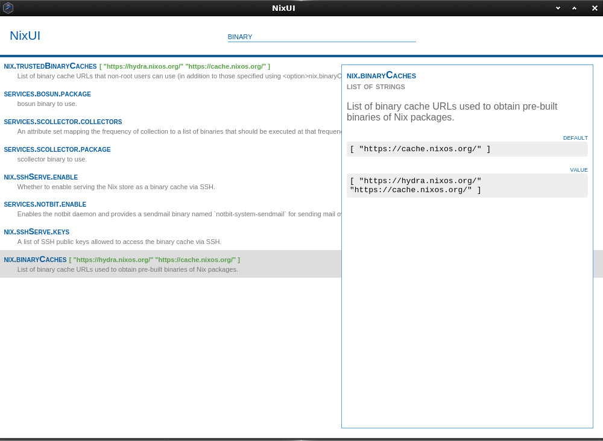
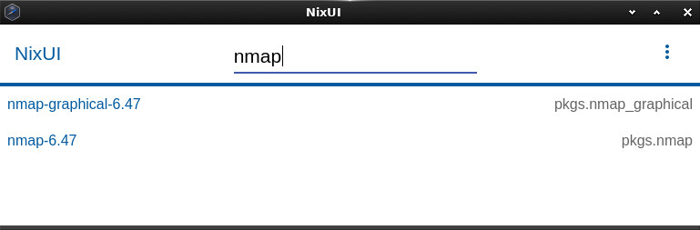
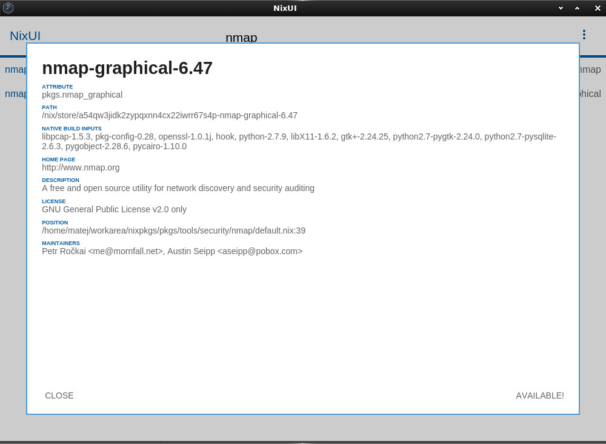

NixUI
=====

NodeWebkit UI for Nix package manager


Requirement
-----------

- Nix package manager


Just Run It
-----------

To try it out, run the following command:

```
$ make just-run-it
```

and wait for the node-webkit window to appear.


config.json
-----------

Location: `./src/config.json`


Default:

```
{
    "profilePaths": ["/nix/var/nix/profiles"],
    "dataDir": "/tmp",
    "configurations": ["/etc/nixos/configuration.nix"],
    "NIX_PATH": "/nix/var/nix/profiles/per-user/root/channels/nixos:nixpkgs=/etc/nixos/nixpkgs:nixos-config=/etc/nixos/configuration.nix"
}
```


Explanation:

 - `profilePaths`: array of paths to search for profiles
 - `dataDir`: for persistant database files
 - `configurations`: array of file paths to your configuration files
 - `NIX_PATH`: same as `NIX_PATH` environment variable, if you use `nix-channel` to update then leave it as is


Development
-----------

Build development environment

```
$ make build
```

Run UI

```
$ make develop
```


Screenshots
-----------




